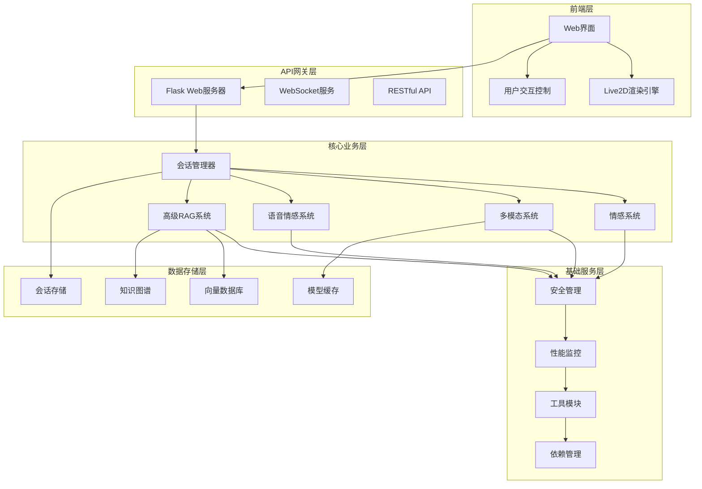

# Live2D虚拟角色系统 - 项目介绍文档

## 1. 项目概述

### 1.1 系统简介
Live2D虚拟角色系统是一个基于人工智能技术的智能虚拟角色交互平台，集成了Live2D动画渲染、情感分析、多模态处理、语音合成等先进技术。系统能够实现与用户的自然语言对话，并通过Live2D角色进行情感化的视觉反馈。

### 1.2 核心功能
- **智能对话系统**：基于大语言模型的自然语言理解与生成
- **情感识别与表达**：实时情感分析和Live2D动画情感表达
- **多模态交互**：支持文本、语音、图像等多种输入方式
- **知识检索增强**：RAG技术提供准确的知识问答能力
- **个性化体验**：用户会话记忆和个性化响应
- **实时语音合成**：情感化语音输出和多语言支持

### 1.3 技术特色
- 模块化架构设计，易于扩展和维护
- 高性能异步处理，支持并发用户访问
- 完善的安全机制和错误处理
- 丰富的API接口，支持多种集成方式
- 跨平台部署，支持Windows/Linux环境

### 1.4 系统展示


上图展示了Live2D虚拟角色系统的主要界面和功能特性：
- **实时交互界面**：清晰直观的用户交互界面，支持多种输入方式
- **Live2D角色渲染**：高质量的2D角色动画，流畅的表情和动作变化
- **情感表达系统**：根据对话内容实时调整角色的情感状态和表情
- **多模态支持**：集成文本、语音、图像等多种交互模式
- **智能对话能力**：基于先进AI技术的自然语言理解和生成

系统界面设计简洁美观，操作流畅自然，为用户提供沉浸式的虚拟角色交互体验。

## 2. 系统架构

### 2.1 整体架构设计



### 2.2 模块关系
- **前端层**：负责用户界面展示和Live2D角色渲染
- **API网关层**：处理HTTP请求和WebSocket连接
- **核心业务层**：实现主要业务逻辑和AI功能
- **基础服务层**：提供安全、监控、工具等支撑服务
- **数据存储层**：管理各类数据存储和缓存

## 3. 核心模块详细介绍

### 3.1 emotion_system - 情感分析和动画控制系统

**功能概述**：
- 实时文本情感分析和情感状态管理
- Live2D动画序列控制和情感表达
- 高级动画控制器和优化的动画序列管理

**核心组件**：
- `EmotionAnalyzer`：情感分析引擎，支持多种情感识别算法
- `EmotionStateManager`：情感状态管理器，维护角色情感状态
- `AnimationSequencer`：动画序列管理器，控制Live2D动画播放
- `AdvancedAnimationController`：高级动画控制器，提供复杂动画逻辑
- `EmotionConfig`：情感配置管理，支持自定义情感映射

**技术特点**：
- 支持多种情感分析模型（BERT、RoBERTa等）
- 线程安全的动画序列管理
- 智能动画优先级调度
- 情感状态平滑过渡

### 3.2 advanced_rag_system - 高级检索增强生成系统

**功能概述**：
- 多模态向量化和知识图谱构建
- 智能内容融合和多模态推理
- 高效的图查询处理和知识检索

**核心组件**：
- `AdvancedRAGManager`：RAG系统总控制器
- `MultimodalVectorizer`：多模态向量化引擎
- `KnowledgeGraphBuilder`：知识图谱构建器
- `ContentFusionEngine`：内容融合引擎
- `MultimodalReasoningEngine`：多模态推理引擎
- `GraphQueryProcessor`：图查询处理器

**技术特点**：
- 支持文本、图像、音频等多模态数据
- 基于图神经网络的知识推理
- 动态知识图谱更新
- 高效的向量相似度检索

### 3.3 multimodal_system - 多模态处理系统

**功能概述**：
- 图像理解和视觉语言模型集成
- 混合媒体检索和多模态AI能力
- 图像处理和分析功能

**核心组件**：
- `MultimodalManager`：多模态系统管理器
- `ImageAnalyzer`：图像分析引擎
- `VisionLanguageModel`：视觉语言模型
- `MultimodalRAG`：多模态检索增强
- `ImageProcessor`：图像处理器

**技术特点**：
- 集成CLIP、BLIP等先进视觉模型
- 支持图文理解和生成
- 多模态特征融合
- 实时图像分析和描述

### 3.4 voice_emotion_system - 语音情感系统

**功能概述**：
- 情感化语音生成和语音风格控制
- 多语言支持和实时语音处理
- 语音情感识别和合成

**核心组件**：
- `VoiceEmotionManager`：语音情感管理器
- `EmotionVoiceSynthesizer`：情感语音合成器
- `VoiceStyleController`：语音风格控制器
- `MultilingualVoiceManager`：多语言语音管理器
- `RealtimeVoiceProcessor`：实时语音处理器

**技术特点**：
- 支持多种TTS引擎
- 情感化语音合成
- 实时语音流处理
- 多语言和方言支持

### 3.5 security - 安全管理模块

**功能概述**：
- API安全验证和访问控制
- 输入验证和安全过滤
- 会话安全和数据保护

**核心功能**：
- 请求频率限制和防护
- 输入内容安全检查
- 文件上传安全验证
- 会话令牌管理
- 敏感信息过滤

### 3.6 utils - 工具模块

**功能概述**：
- 系统工具和辅助功能
- 性能监控和日志管理
- 依赖管理和配置工具

**核心组件**：
- 性能监控工具
- 日志记录系统
- 配置管理器
- 文件处理工具
- 网络通信工具

## 4. Live2D模型支持说明

### 4.1 支持的模型格式
- **.model3.json**：Live2D Cubism 3.0+模型文件
- **.moc3**：模型数据文件
- **.physics3.json**：物理参数文件
- **.cdi3.json**：显示信息文件

### 4.2 动画支持
- **表情动画**：支持多种情感表情切换
- **动作动画**：支持手势、姿态等动作表现
- **物理模拟**：支持头发、衣物等物理效果
- **眨眼和呼吸**：自动眨眼和呼吸动画

### 4.3 交互功能
- **鼠标跟随**：角色视线跟随鼠标移动
- **触摸反应**：支持点击交互和反馈
- **情感映射**：文本情感自动映射到角色表情
- **语音同步**：语音播放时的口型同步

## 5. 技术栈和依赖

### 5.1 核心技术栈
- **后端框架**：Flask + Python 3.8+
- **前端技术**：HTML5 + JavaScript + Live2D SDK
- **AI框架**：PyTorch + Transformers + LangChain
- **数据库**：ChromaDB (向量数据库) + NetworkX (图数据库)
- **语音处理**：librosa + soundfile + pydub

### 5.2 主要依赖库
```
# Web框架
Flask==2.3.3
Flask-CORS==4.0.0
Flask-SocketIO==5.3.6

# AI/ML核心
torch>=1.9.0
transformers>=4.21.0
langchain>=0.0.200
sentence-transformers>=2.2.0

# 多模态处理
opencv-python>=4.5.0
Pillow>=8.3.0
numpy>=1.21.0

# 语音处理
librosa>=0.9.0
soundfile>=0.10.0
pydub>=0.25.0

# 数据存储
chromadb>=0.3.0
networkx>=2.8.0
pypdf>=3.0.0

# 系统工具
psutil>=5.8.0
requests>=2.28.0
pyyaml>=6.0
```

### 5.3 系统依赖
- **FFmpeg**：音视频处理
- **Ollama**：本地大语言模型服务
- **Git LFS**：大文件版本控制
- **spaCy语言模型**：自然语言处理

## 6. 主要功能特性

### 6.1 智能对话功能
- 支持多轮对话和上下文理解
- 个性化回复和记忆功能
- 多种对话模式（闲聊、问答、任务执行）
- 实时响应和流式输出

### 6.2 情感交互功能
- 实时情感识别和分析
- 丰富的情感表达动画
- 情感状态记忆和延续
- 自适应情感响应

### 6.3 多模态处理功能
- 图像上传和理解
- 图文混合对话
- 语音输入和输出
- 多媒体内容检索

### 6.4 知识问答功能
- 基于RAG的准确问答
- 知识图谱推理
- 文档检索和总结
- 实时知识更新

## 7. 部署和运行说明

### 7.1 环境要求
- **操作系统**：Windows 10+ / Linux Ubuntu 18.04+
- **Python版本**：3.8 - 3.11
- **内存要求**：8GB+ (推荐16GB)
- **显卡要求**：支持CUDA的NVIDIA显卡 (可选)
- **存储空间**：20GB+ 可用空间

### 7.2 安装步骤
```bash
# 1. 克隆项目
git clone <repository_url>
cd live2d-ai-system

# 2. 创建虚拟环境
python -m venv venv
source venv/bin/activate  # Linux
# 或
venv\Scripts\activate     # Windows

# 3. 安装依赖
pip install -r requirements.txt

# 4. 安装系统依赖
# 安装FFmpeg、Ollama等

# 5. 配置环境变量
cp .env.example .env
# 编辑.env文件设置必要参数

# 6. 启动服务
python server.py
```

### 7.3 配置说明
- **模型配置**：在`config/`目录下配置AI模型参数
- **Live2D模型**：将模型文件放置在`models/live2d/`目录
- **API密钥**：配置各种AI服务的API密钥
- **数据库配置**：设置向量数据库和图数据库参数

### 7.4 服务启动
```bash
# 开发模式
python server.py --debug

# 生产模式
gunicorn -w 4 -b 0.0.0.0:5000 server:app

# 使用Docker
docker-compose up -d
```

## 8. 性能优化特点

### 8.1 系统性能优化
- **异步处理**：基于asyncio的高并发处理
- **缓存机制**：多层缓存提升响应速度
- **资源池化**：模型和连接资源复用
- **负载均衡**：支持多实例部署

### 8.2 AI模型优化
- **模型量化**：减少内存占用和推理时间
- **批处理**：批量处理提升吞吐量
- **模型缓存**：热门模型常驻内存
- **GPU加速**：支持CUDA加速推理

### 8.3 动画性能优化
- **动画预加载**：常用动画预先加载
- **帧率控制**：自适应帧率调整
- **资源压缩**：Live2D资源优化压缩
- **渲染优化**：WebGL硬件加速渲染

### 8.4 网络优化
- **数据压缩**：gzip压缩减少传输量
- **CDN支持**：静态资源CDN加速
- **WebSocket**：实时通信减少延迟
- **请求合并**：减少HTTP请求数量

## 9. 扩展性和可维护性

### 9.1 模块化设计
- **松耦合架构**：模块间依赖最小化
- **插件机制**：支持功能模块热插拔
- **接口标准化**：统一的API接口规范
- **配置驱动**：通过配置文件控制行为

### 9.2 扩展能力
- **新模型集成**：易于集成新的AI模型
- **功能模块扩展**：支持自定义功能模块
- **多语言支持**：国际化和本地化支持
- **第三方集成**：丰富的API接口

### 9.3 维护特性
- **完善的日志系统**：详细的操作和错误日志
- **性能监控**：实时系统性能监控
- **健康检查**：自动健康状态检测
- **错误恢复**：自动错误恢复机制

### 9.4 开发支持
- **代码规范**：统一的代码风格和规范
- **单元测试**：完整的测试用例覆盖
- **文档完善**：详细的API和开发文档
- **调试工具**：丰富的调试和分析工具

## 10. 应用场景

### 10.1 教育培训
- 智能教学助手
- 语言学习伙伴
- 知识问答系统
- 个性化学习指导

### 10.2 客户服务
- 智能客服机器人
- 产品咨询助手
- 售后服务支持
- 用户引导系统

### 10.3 娱乐互动
- 虚拟主播
- 游戏NPC
- 互动娱乐
- 社交陪伴

### 10.4 企业应用
- 内部知识库
- 培训系统
- 会议助手
- 工作流程指导

---

**项目维护团队** luoxiao

